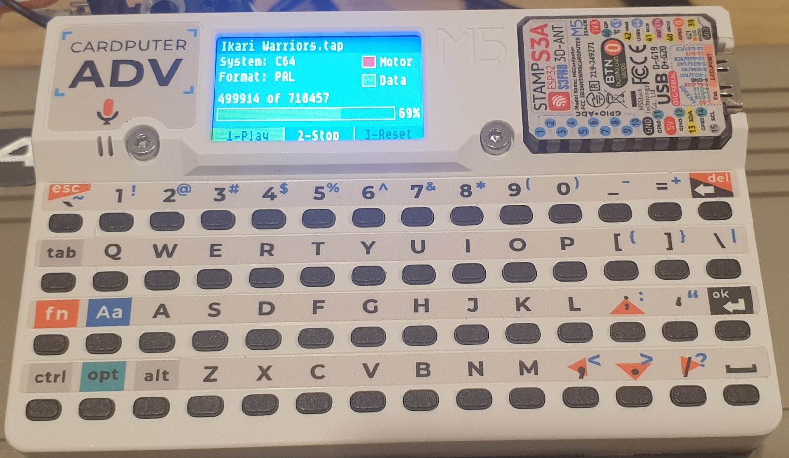
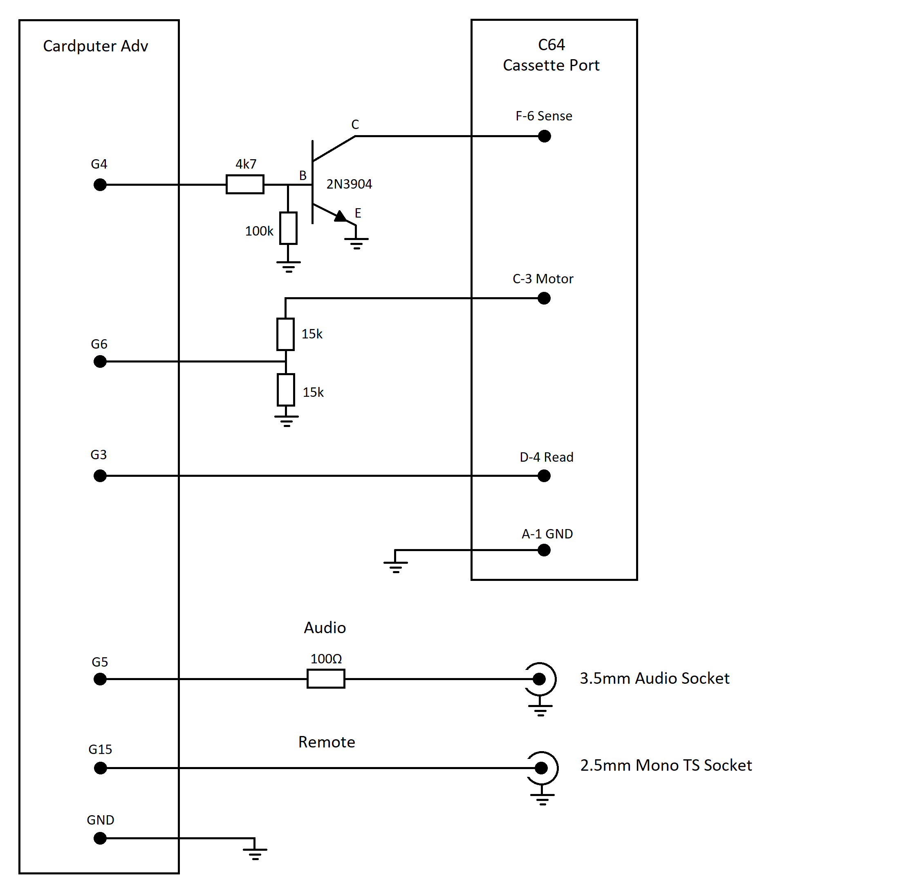
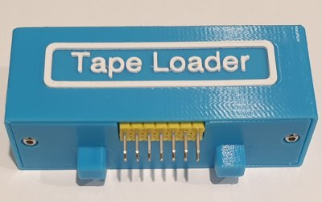
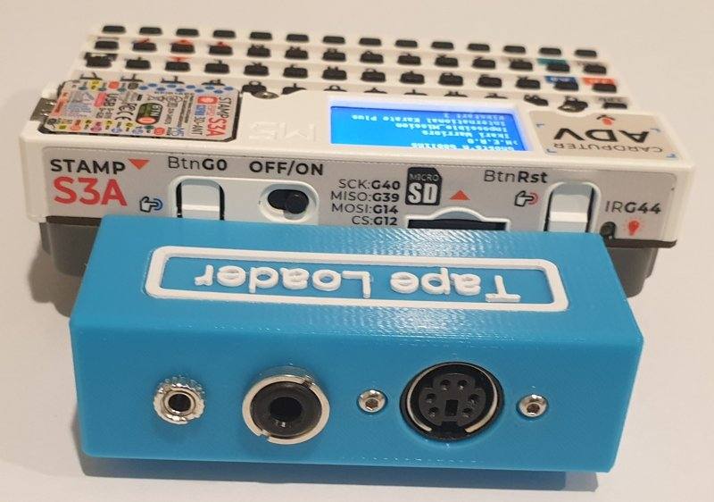
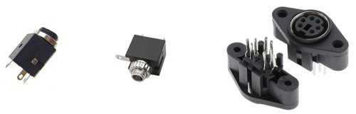
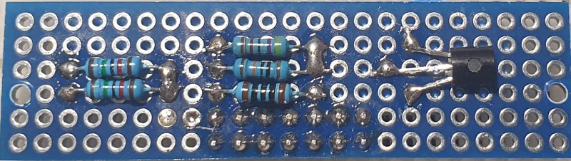
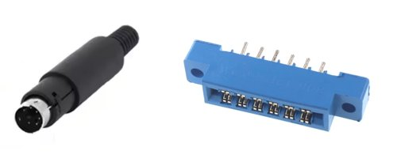

# Cardputer 8-Bit Tape Loader

Load Commodore, ZX Spectrum, MSX, Acorn and BBC Micro tape files using a Cardputer Adv.

This project is a work in progress. I assume no responsibility or liability for any errors, omissions, or outcomes resulting from the use of the information provided within this project.



## Wiring Diagram<br />


## Usage<br />
The app lets you browse and select tape files from the SD card.<br />
All tape files must be uncompressed tape images.<br />

### File Browser<br />
Arrow Up: Move up<br />
Arrow Down: Move down<br />
Enter: Select<br />
Backspace: Back<br />
Letter: Move to next directory or file beginning with that letter.<br />

### Tape Player<br />
1: Play<br />
2: Stop<br />
3: Reset<br />
Backspace: Exit<br />

### Commodore<br />
Supports tap files.<br />
Press M to enable/disable motor control.<br />

### ZX Spectrum<br />
Supports tap and tzx files.<br />
Press Arrow Left and Arrow Right to toggle between 48K and 128K mode.<br />

### MSX<br />
Supports cas files.<br />
Press R to enable/disable remote control.<br />

### Acorn and BBC Micro<br />
Supports uef and hq files.<br />
Press R to enable/disable remote control.<br />

<br />Make sure uef files are uncompressed. Some uef files are gzip‑compressed and will need to be decompressed using a tool like gzip.<br />

## Installation<br />
Download the .bin file from the releases page.<br />
Flash the image with esptool: (you might need to specify the --port argument if esptool can't detect your Cardputer)<br />
```
esptool.py --chip esp32s3 write_flash 0x0 Cardputer_8_Bit_Tape_Loader_*.bin
```
## Tape Loader Module<br />

<table>
<tr>
<td></td>
<td></td>
</tr>
</table>

### Parts<br />

<br />
<ul>
<li>2.54mm Male Pin Header</li>
<li>3.5mm Audio Socket</li>
<li>2.5mm Mono Socket</li>
<li>6 Pin Mini DIN Female Socket</li>
</ul>

### Board<br />

Use a perfboard with 2.54 mm pitch, arranged in a 23 by 6 hole grid.
<br />Place the components on the top side of the board so the module bottom panel can sit flush against the underside of the board.
<br />Drill holes to accommodate 2mm screws.



### Commodore Cable<br />

<br />
You can make a cable using a male 6 pin mini DIN plug and 12 pin edge connector with 3.96mm Pitch.<br />


### 3D Files<br />

View 3D files: [8-Bit Tape Loader 3D Files](../assets/3d_files/)